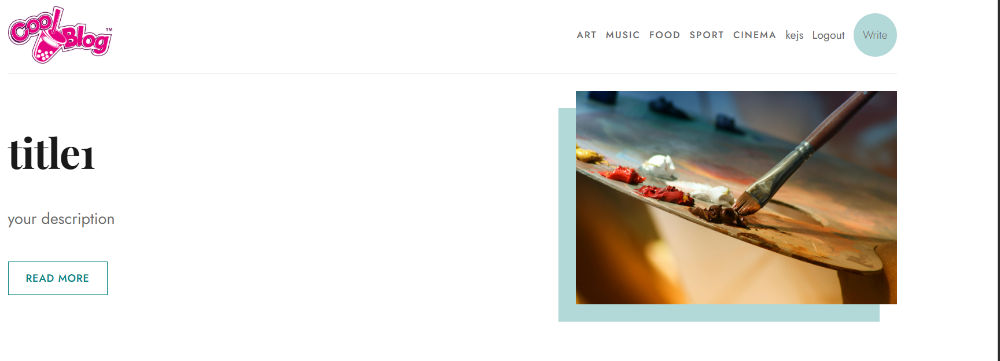
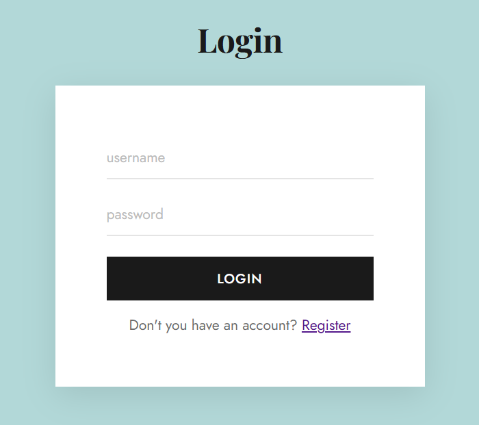
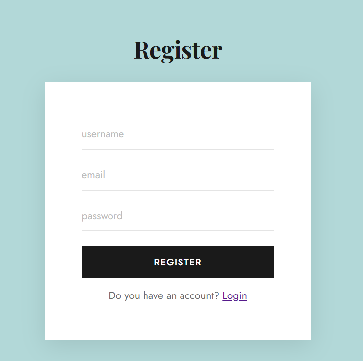
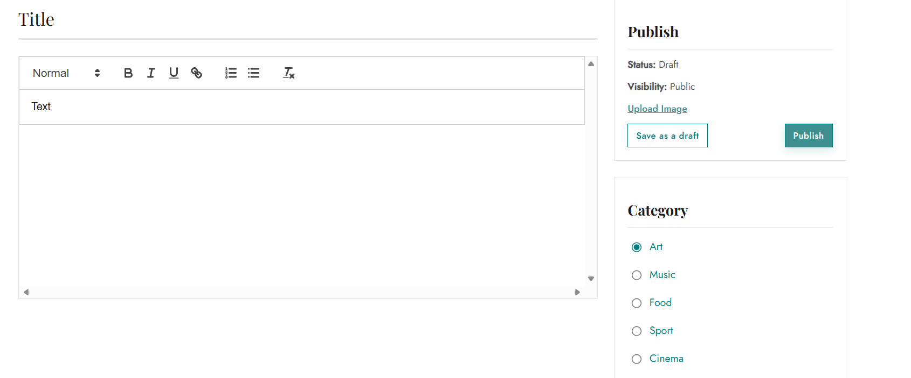

# CodVeda-Intern
# Blog — Full-Stack CRUD Application

A full-stack blog application with complete CRUD functionality, built with React, Node.js, Express, and MySQL.

---

## Description

This project is a full-stack web application that demonstrates CRUD (Create, Read, Update, Delete) functionality through a blog platform. Users can create, view, edit, and delete blog posts through a React-powered frontend that communicates with a RESTful Express API backed by a MySQL database.

---

## Objectives

- Set up a back-end server using **Express.js**
- Build a **REST API** to handle all CRUD operations
- Develop a **React** frontend that interacts with the back-end API
- Use **MySQL** as the database to persist data

---

## Tech Stack

| Layer | Technology |
|-------|-----------|
| Frontend | React |
| Backend | Node.js + Express.js |
| Database | MySQL |
| API Style | REST |

---

## Features

- **Create** — Write and publish new blog posts
- **Read** — Browse all posts or view a single post in detail
- **Update** — Edit existing blog post content
- **Delete** — Remove blog posts permanently

---

## Project Structure

```
blog/
├── client/                  # React frontend
│   ├── public/
│   └── src/
│       ├── components/      # Reusable UI components
│       ├── pages/           # Home, PostDetail, CreatePost, EditPost
│       ├── App.jsx
│       └── main.jsx
├── server/                  # Express backend
│   ├── routes/              # API route definitions
│   ├── controllers/         # CRUD logic
│   ├── db.js                # MySQL connection
│   └── index.js             # Server entry point
├── .env                     # Environment variables (not committed)
├── .gitignore
└── README.md
```

---


### Prerequisites

- [Node.js](https://nodejs.org/) v18+
- [MySQL](https://www.mysql.com/) v8+
- npm


### Set Up the Database

```sql
CREATE DATABASE blog_db;

USE blog_db;

CREATE TABLE posts (
  id INT AUTO_INCREMENT PRIMARY KEY,
  title VARCHAR(255) NOT NULL,
  content TEXT NOT NULL,
  author VARCHAR(100),
  created_at TIMESTAMP DEFAULT CURRENT_TIMESTAMP,
  updated_at TIMESTAMP DEFAULT CURRENT_TIMESTAMP ON UPDATE CURRENT_TIMESTAMP
);
```

###  Configure Environment Variables

Create a `.env` file in the `server/` directory:

```env
DB_HOST=localhost
DB_USER=root
DB_PASSWORD=your_password
DB_NAME=blog_db
PORT=5000
```

###  Install Dependencies

**Backend:**
```bash
cd server
npm install
```

**Frontend:**
```bash
cd ../client
npm install
```

### 5. Run the Application

**Start the backend** (runs on `http://localhost:5000`):
```bash
cd server
npm start
```

**Start the frontend** (runs on `http://localhost:5173`):
```bash
cd client
npm run dev
```

---

## REST API Endpoints

| Method | Endpoint | Description |
|--------|----------|-------------|
| GET | `/api/posts` | Fetch all blog posts |
| GET | `/api/posts/:id` | Fetch a single post by ID |
| POST | `/api/posts` | Create a new blog post |
| PUT | `/api/posts/:id` | Update an existing post |
| DELETE | `/api/posts/:id` | Delete a post |

### Example Request — Create a Post

```json
POST /api/posts
Content-Type: application/json

{
  "title": "My First Post",
  "content": "Hello world! This is my first blog post.",
  "author": "John"
}
```

---

## Screenshots




---

## Reference

- Tutorial: [Full-Stack CRUD Application](https://youtu.be/0aPLk2e2Z3g?si=GNb2B4Ip2mlxgo7G)
- Tools: Node.js, Express.js, React, MySQL

---

## License

This project was built for educational purposes.